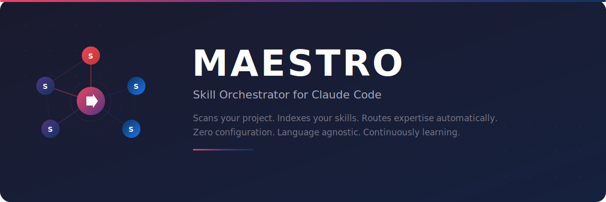

# Maestro — Production RAG for Skill Knowledge Retrieval

<p align="center">
  
</p>

<p align="center">
  <a href="https://opensource.org/licenses/MIT"></a>
  <a href="https://claude.ai/"></a>
  <a href="#install"></a>
  <a href="#mcp"></a>
</p>

Maestro is a **production-grade RAG engine** that sits between Claude Code and your skills. It indexes every skill into a vector database, then retrieves only the relevant knowledge for each task — so Claude gets expert context without burning the entire context window.

> You have 50+ specialized skills installed. Loading all of them on every task wastes tokens and degrades output. Maestro retrieves only what matters, in under 100ms.

---

## What changed (v2)

The previous version used markdown-based semantic matching and decision trees. **v2 replaces this with a real RAG pipeline:**

| | v1 (markdown) | v2 (Python RAG) |
|-|--------------|----------------|
| **Search** | Keyword matching + decision trees | ChromaDB vector search + BM25 hybrid |
| **Recall** | Keyword-dependent | Concept graph expansion (T1) |
| **Precision** | Score thresholds | Cross-encoder reranking (T5) |
| **Context size** | Full SKILL.md files | Only relevant chunks (~400 tokens each) |
| **Integration** | Claude reads skill files | MCP tool (`search_skills`) |
| **Speed** | Instant (no index) | <100ms after first index |

---

## 5 Quality Techniques

| # | Technique | Effect |
|---|-----------|--------|
| **T1** | Concept graph expansion | "Sendable warning" → also searches actor isolation, data race, thread safety |
| **T2** | Skill fingerprinting | Prunes irrelevant skills before searching — faster, less noise |
| **T3** | Contextual embeddings | Each chunk carries its skill+file context → better semantic matching |
| **T4** | Hybrid search + RRF | Semantic (ChromaDB) + lexical (BM25) fused with Reciprocal Rank Fusion |
| **T5** | Cross-encoder reranking | Precise relevance scoring on top candidates |

---

## Install

```bash
pip install maestro-rag
```

Or from source:

```bash
git clone https://github.com/Viniciuscarvalho/maestro.git
cd maestro
pip install -e .
```

---

## Quick Start

### 1. Setup (one-time)

```bash
# Full setup: moves skills, installs gateway, configures MCP, runs initial index
maestro-setup

# Claude.ai users (no MCP):
maestro-setup --claude-ai-only

# Preview what would happen:
maestro-setup --dry-run
```

What `maestro-setup` does:
1. Creates `~/.maestro/skills/` — the skill knowledge base
2. Moves skills from `~/.claude/skills/` → `~/.maestro/skills/`
3. Installs a lightweight Gateway `SKILL.md` in `.claude/skills/maestro/`
4. Configures MCP in `.claude/mcp.json`
5. Runs initial indexation

### 2. With Claude Code (MCP)

After setup, Claude Code automatically calls `search_skills` before every coding task. No configuration needed in your prompts.

```json
// .claude/mcp.json (auto-configured by maestro-setup)
{
  "mcpServers": {
    "maestro": { "command": "maestro-mcp" }
  }
}
```

### 3. Manual indexing

```bash
# Index all discovered skills
maestro index

# Index specific directories
maestro index ~/.claude/skills/swift-concurrency ./my-custom-skills

# Check what's indexed
maestro status
```

### 4. Search

```bash
# Search
maestro search "Sendable conformance for actor classes"

# Get LLM-ready context block (for Claude.ai paste)
maestro context "SwiftUI @Observable state management"

# Debug: see HOW the pipeline worked
maestro explain "async await task cancellation"
```

---

## Architecture

```
┌─────────────────────────────────────────────────────────────┐
│  Claude Code                                                │
│    └─ reads SKILL.md gateway (~750 tokens)                  │
│    └─ calls search_skills("what I need") via MCP            │
└──────────────────────┬──────────────────────────────────────┘
                       │
┌──────────────────────▼──────────────────────────────────────┐
│  Maestro RAG Engine (Python)                                │
│                                                             │
│  T1: Concept expansion  → "async" + task, suspension, await │
│  T2: Skill fingerprint  → prune to top-K relevant skills    │
│  T3: Context embeddings → chunks carry full provenance      │
│  T4: Hybrid search      → ChromaDB semantic + BM25 lexical  │
│       └─ RRF fusion     → merge rankings                    │
│  T5: Cross-encoder      → rerank top candidates             │
└──────────────────────┬──────────────────────────────────────┘
                       │
┌──────────────────────▼──────────────────────────────────────┐
│  ChromaDB (~/.maestro/vectordb/)                            │
│    5000+ chunks from 100+ skills                            │
│    Persistent, fast, local                                  │
└─────────────────────────────────────────────────────────────┘
```

---

## Configuration

`~/.maestro/config.yaml` (auto-created on first run):

```yaml
# Skill directories to index
skill_paths:
  - ~/.maestro/skills
  - ~/.claude/skills
  - .claude/skills   # project-local skills

# Embedding model
embedding_provider: local          # or "voyage" (requires VOYAGE_API_KEY)
local_model: all-MiniLM-L6-v2     # fast, good quality
# voyage_model: voyage-code-3     # better for code (optional)

# Search quality
reranker_enabled: true
top_k: 7
min_relevance: 0.15
chunk_max_tokens: 400
```

### Optional: VoyageAI embeddings (better for code)

```bash
pip install maestro-rag[voyage]
export VOYAGE_API_KEY=your_key
```

Update `~/.maestro/config.yaml`:
```yaml
embedding_provider: voyage
voyage_model: voyage-code-3
```

---

## CLI Reference

```
maestro index  [PATH...]    Index skill directories
maestro search  QUERY       Search with full pipeline
maestro context QUERY       Get LLM-ready context block
maestro explain QUERY       Debug: show pipeline internals
maestro status              Show index stats
maestro clear               Clear the index
```

---

## File Structure

```
maestro/
├── SKILL.md                      # Gateway (Claude loads this only)
├── pyproject.toml                # Package config
└── src/maestro_rag/
    ├── engine.py                 # Core RAG engine (T1–T5)
    ├── concept_graph.py          # Pre-computed Swift concept graph (T1)
    ├── cli.py                    # CLI commands
    ├── mcp_server.py             # MCP stdio server
    └── setup.py                  # One-command setup
```

---

## Requirements

- Python 3.11+
- Any Claude interface (Claude Code with MCP recommended, Claude.ai supported)
- Skills installed in `~/.maestro/skills/` or `~/.claude/skills/`

---

## License

[MIT](https://opensource.org/licenses/MIT)
