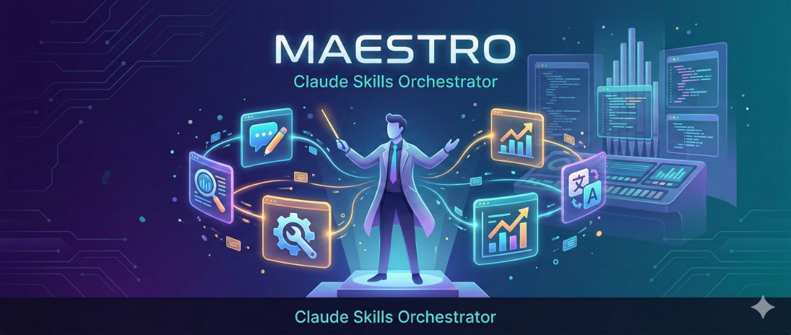

# Maestro — Production RAG for Skill Knowledge Retrieval

<p align="center">
  
</p>

<p align="center">
  <a href="https://opensource.org/licenses/MIT"></a>
  <a href="https://claude.ai/"></a>
  <a href="#install"></a>
  <a href="#mcp"></a>
  <br/>
  <a href="https://github.com/sponsors/Viniciuscarvalho"></a>
</p>

Maestro is a **production-grade RAG engine** that sits between Claude Code and your skills. It indexes every skill into a vector database, then retrieves only the relevant knowledge for each task — so Claude gets expert context without burning the entire context window.

> You have 50+ specialized skills installed. Loading all of them on every task wastes tokens and degrades output. Maestro retrieves only what matters, in under 100ms.

---

## How it works in practice

**After a one-time setup, Maestro is completely invisible.** You write code normally — Claude Code handles everything automatically.

```
You open any project
        ↓
Claude Code reads the Gateway SKILL.md (~750 tokens, fixed)
        ↓
Before writing any code, Claude calls search_skills("what it needs")
        ↓
maestro-mcp spawns, searches the index, returns 5–7 relevant chunks
        ↓
Claude applies the knowledge — you see only the result
```

`maestro-mcp` is **not a background daemon**. Claude Code spawns it on demand as a stdio subprocess, uses it, and discards it. Nothing is left running between tasks.

The knowledge index (`~/.maestro/vectordb/`) **persists on disk** — it is only rebuilt when you add or modify a skill, not on every session or project open.

### Do I need to use the CLI?

| Scenario                        | CLI needed?                                         |
| ------------------------------- | --------------------------------------------------- |
| Claude Code + MCP (recommended) | **No** — fully automatic after setup                |
| Claude.ai (no MCP support)      | **Yes** — paste `maestro context` output manually   |
| Adding new skills               | `maestro index` — rebuilds the index                |
| Debugging a search result       | `maestro explain "query"` — shows the full pipeline |
| Checking what is indexed        | `maestro status`                                    |

---

## What changed (v2)

The previous version used markdown-based semantic matching and decision trees. **v2 replaces this with a real RAG pipeline:**

|                  | v1 (markdown)                     | v2 (Python RAG)                         |
| ---------------- | --------------------------------- | --------------------------------------- |
| **Search**       | Keyword matching + decision trees | ChromaDB vector search + BM25 hybrid    |
| **Recall**       | Keyword-dependent                 | Concept graph expansion (T1)            |
| **Precision**    | Score thresholds                  | Cross-encoder reranking (T5)            |
| **Context size** | Full SKILL.md files               | Only relevant chunks (~400 tokens each) |
| **Integration**  | Claude reads skill files          | MCP tool (`search_skills`)              |
| **Speed**        | Instant (no index)                | <100ms after first index                |

---

## 7 Quality Techniques

| #      | Technique                | Effect                                                                       |
| ------ | ------------------------ | ---------------------------------------------------------------------------- |
| **T1** | Concept graph expansion  | "Sendable warning" → also searches actor isolation, data race, thread safety |
| **T2** | Skill fingerprinting     | Prunes irrelevant skills before searching — faster, less noise               |
| **T3** | Contextual embeddings    | Each chunk carries its skill+file context → better semantic matching         |
| **T4** | Hybrid search + RRF      | Semantic (ChromaDB) + lexical (BM25) fused with Reciprocal Rank Fusion       |
| **T5** | Cross-encoder reranking  | Precise relevance scoring on top candidates                                  |
| **T6** | Diffusion reranking      | Iterative score diffusion — chunks reinforce semantically similar neighbors  |
| **T7** | HJB-Bellman optimization | Adaptive damping per query via learned value function (improves over time)   |

---

## How it Works (Deep Dive)

> **Maestro does NOT do keyword matching.** It uses neural embeddings that understand meaning. "how to avoid data race" finds chunks about "thread safety" and "actor isolation" even if those exact words never appear in the query.

### Step 1: Indexing — turning text into vectors

When you run `maestro index` (or on first `search_skills` call), every `.md` file in your skills is processed:

```
SKILL.md text
    ↓
Split into sections (by H1-H3 headers)
    ↓
Each section → chunks of ~400 tokens (with 50-token overlap)
    ↓
Each chunk gets a context prefix: "[skill_name | file.md]\ndescription\n\nchunk_text"
    ↓
SentenceTransformer (all-MiniLM-L6-v2) encodes each chunk
    ↓
384-dimensional vector stored in ChromaDB + metadata (skill, file, section, domains)
```

The model `all-MiniLM-L6-v2` was trained on **millions of text pairs** to learn semantic similarity. It maps text into a 384-dimensional space where **texts with similar meaning are geometrically close** (high cosine similarity). This is fundamentally different from comparing strings.

### Step 2: Searching — 7 techniques in pipeline

When Claude calls `search_skills("Sendable conformance warning in actor")`:

```
┌─ T1: Concept Expansion ──────────────────────────────────────┐
│  Query: "Sendable conformance warning in actor"              │
│  + expanded: "actor isolation", "data race", "thread safety" │
│  Pre-computed graph of 100+ concept relationships            │
└──────────────────────────────────┬───────────────────────────┘
                                   ↓
┌─ T2: Skill Fingerprinting ──────────────────────────────────┐
│  Compare query embedding vs. skill fingerprints             │
│  Keep: swift-concurrency, swift-expert (2 of 40+ skills)    │
│  Discard: ASO, marketing, CLI tools, etc.                   │
│  Result: search 200 chunks instead of 3000+ (15x faster)    │
└──────────────────────────────────┬──────────────────────────┘
                                   ↓
┌─ T4: Hybrid Search ────────────────────────────────────────┐
│                                                             │
│  Semantic (ChromaDB)          Lexical (BM25)                │
│  ┌───────────────────┐       ┌───────────────────┐         │
│  │ cosine similarity │       │ TF-IDF keyword    │         │
│  │ between vectors   │       │ matching          │         │
│  │                   │       │                   │         │
│  │ Finds: "crossing  │       │ Finds: chunks     │         │
│  │ isolation boundary│       │ mentioning        │         │
│  │ with non-Sendable │       │ "@Sendable" and   │         │
│  │ types" (no exact  │       │ "actor" literally │         │
│  │ word match needed)│       │                   │         │
│  └─────────┬─────────┘       └─────────┬─────────┘         │
│            └──────────┬────────────────┘                    │
│                       ↓                                     │
│              RRF Fusion: 1/(k + rank)                       │
│              Merges both rankings into one                  │
└──────────────────────────────────┬──────────────────────────┘
                                   ↓
┌─ T6: Diffusion Reranking ──────────────────────────────────┐
│  Build similarity graph between result chunks               │
│  Iteratively propagate scores (3-5 iterations)              │
│  High-scoring chunks boost semantically similar neighbors   │
│  Early-stop when scores converge (Δ < epsilon)              │
└──────────────────────────────────┬──────────────────────────┘
                                   ↓
┌─ T7: HJB-Bellman Optimization ─────────────────────────────┐
│  Adaptive damping based on learned value function V(s)      │
│  Tri-component reward: relevance + context_fit + affinity   │
│  Query-type scheduling: architecture→5 iter, API→2 iter    │
│  Gets better over time via Bellman updates (SQLite cache)   │
└──────────────────────────────────┬──────────────────────────┘
                                   ↓
                    5-7 most relevant chunks (~2000 tokens)
                    returned to Claude as expert context
```

### Why semantic search beats keyword search

|                                          | Keyword Search (grep)                                           | Semantic Search (Maestro)                                                                |
| ---------------------------------------- | --------------------------------------------------------------- | ---------------------------------------------------------------------------------------- |
| Query: "avoid data race"                 | Only finds chunks containing "data race"                        | Also finds "thread safety", "actor isolation", "Sendable conformance"                    |
| Query: "how to navigate between screens" | Misses chunks about "NavigationStack" unless exact word matches | Finds NavigationStack, coordinator pattern, deep linking                                 |
| Query: "@Observable state"               | Finds literal matches only                                      | Understands this is about SwiftUI state management, also finds @State, @Binding patterns |
| Typo: "Sendabel"                         | Finds nothing                                                   | Still finds Sendable chunks (embedding is robust to typos)                               |

### Why this matters for token efficiency

```
Without Maestro:
  50 skills × ~3000 tokens each = 150,000 tokens loaded
  Claude's context window = overwhelmed, quality degrades

With Maestro:
  Gateway SKILL.md = 750 tokens (fixed, always loaded)
  search_skills result = ~2000 tokens (only relevant chunks)
  Total = ~2,750 tokens — 55x reduction
```

---

## Install

### As a Claude Code Plugin (recommended)

```
/plugin install maestro
```

That's it. The plugin automatically:

- Registers the `search_skills` MCP tool
- Installs the Gateway SKILL.md
- Sets up a Python venv at `~/.maestro/.venv/` on first run

### Manual (standalone)

```bash
git clone https://github.com/Viniciuscarvalho/maestro.git
cd maestro
python3 -m venv .venv && .venv/bin/pip install -e .
.venv/bin/maestro-setup
```

For standalone users, add the MCP config manually to `~/.claude/mcp.json`:

```json
{
  "mcpServers": {
    "maestro": { "command": "maestro-mcp" }
  }
}
```

---

## Quick Start

### 1. Setup (one-time, per machine)

Plugin users skip this step — setup is automatic.

Standalone users:

```bash
# Full setup: moves skills, runs initial index
maestro-setup

# Preview what would happen without making changes:
maestro-setup --dry-run
```

What `maestro-setup` does:

1. Creates `~/.maestro/skills/` — the skill knowledge base
2. Moves skills from `~/.claude/skills/` → `~/.maestro/skills/`
3. Runs initial indexation and populates the Skill Index in the Gateway

### 2. That's it — Claude Code does the rest

After setup, open any project in Claude Code and start working normally. Maestro is active in the background:

- Claude reads the Gateway SKILL.md (750 tokens, always loaded)
- Before every coding task, Claude calls `search_skills` automatically
- The relevant knowledge chunks are retrieved and applied — no prompts, no manual steps

---

## Manual indexing

Only needed when you add or update skills:

```bash
# Re-index all skill directories
maestro index

# Index specific directories only
maestro index ~/.claude/skills/swift-concurrency ./my-custom-skills

# Check what is currently indexed
maestro status
```

`maestro index` also updates the Skill Index table in all Gateway `SKILL.md` files automatically.

---

## Using with Claude.ai (no MCP)

Claude.ai does not support MCP tools. The workflow is manual but still works:

```bash
# Run in terminal, then paste the output into the Claude.ai conversation
maestro context "SwiftUI @Observable state management"
```

The Gateway `SKILL.md` contains a Skill Index so Claude knows what knowledge is available and can ask you to run `maestro context` for the relevant topic.

---

## Search

```bash
# Interactive search
maestro search "Sendable conformance for actor classes"

# Get LLM-ready context block (for Claude.ai copy-paste)
maestro context "SwiftUI @Observable state management"

# Debug: see exactly HOW the pipeline worked
maestro explain "async await task cancellation"
```

---

## Architecture

```
┌─────────────────────────────────────────────────────────────┐
│  Claude Code                                                │
│    └─ reads SKILL.md gateway (~750 tokens, fixed)           │
│    └─ calls search_skills("what I need") via MCP            │
└──────────────────────┬──────────────────────────────────────┘
                       │ on-demand subprocess (stdio)
┌──────────────────────▼──────────────────────────────────────┐
│  Maestro RAG Engine (Python)                                │
│                                                             │
│  T1: Concept expansion  → "async" + task, suspension, await │
│  T2: Skill fingerprint  → prune to top-K relevant skills    │
│  T3: Context embeddings → chunks carry full provenance      │
│  T4: Hybrid search      → ChromaDB semantic + BM25 lexical  │
│       └─ RRF fusion     → merge rankings                    │
│  T5: Cross-encoder      → rerank top candidates             │
│  T6: Diffusion ranker   → iterative score propagation       │
│  T7: HJB-Bellman        → adaptive optimization over time   │
│       └─ Query classifier → per-type scheduling             │
└──────────────┬──────────────────────┬───────────────────────┘
               │                      │
┌──────────────▼────────────┐  ┌──────▼──────────────────────┐
│  ChromaDB                 │  │  SQLite                     │
│  ~/.maestro/vectordb/     │  │  ~/.maestro/reward_cache.db │
│  5000+ chunks, 100+ skills│  │  Learned rewards + values   │
│  Persistent on disk       │  │  Gets smarter over time     │
└───────────────────────────┘  └─────────────────────────────┘
```

---

## Configuration

`~/.maestro/config.yaml` (auto-created on first run):

```yaml
# Skill directories to index
skill_paths:
  - ~/.maestro/skills
  - ~/.claude/skills
  - .claude/skills # project-local skills

# Embedding model
embedding_provider: local # or "voyage" (requires VOYAGE_API_KEY)
local_model: all-MiniLM-L6-v2 # fast, good quality
# voyage_model: voyage-code-3     # better for code (optional)

# Search quality
reranker_enabled: true
top_k: 7
min_relevance: 0.15
chunk_max_tokens: 400

# Diffusion RL (v1.0.1+) — adaptive ranking that improves over time
diffusion_rl_enabled: false # set to true to enable T6/T7
diffusion_iterations: 3 # max iterations (overridden per query type)
hjb_discount_factor: 0.95 # Bellman discount factor
hjb_learning_rate: 0.01 # value function learning rate
hjb_min_episodes: 10 # min queries before adapting damping
```

### Optional: VoyageAI embeddings (better for code)

```bash
pip install maestro-rag[voyage]
export VOYAGE_API_KEY=your_key
```

Update `~/.maestro/config.yaml`:

```yaml
embedding_provider: voyage
voyage_model: voyage-code-3
```

---

## CLI Reference

```
maestro index  [PATH...]    Index skill directories (also updates Skill Index)
maestro search  QUERY       Search with full pipeline
maestro context QUERY       Get LLM-ready context block (for Claude.ai paste)
maestro explain QUERY       Debug: show pipeline internals
maestro status              Show index stats
maestro clear               Clear the index
```

---

## File Structure

```
maestro/
├── .claude-plugin/
│   └── plugin.json               # Plugin manifest
├── skills/
│   └── maestro/
│       └── SKILL.md              # Gateway (Claude loads this only)
├── hooks/
│   └── hooks.json                # SessionStart hook for auto-setup
├── .mcp.json                     # Plugin MCP server config
├── scripts/
│   └── maestro-mcp.sh            # Wrapper that ensures venv + runs MCP
├── pyproject.toml                # Package config
└── src/maestro_rag/
    ├── engine.py                 # Core RAG engine (T1–T7 pipeline)
    ├── concept_graph.py          # Pre-computed concept graph (T1)
    ├── diffusion_ranker.py       # Iterative score diffusion (T6)
    ├── hjb_solver.py             # HJB-Bellman optimizer + reward cache (T7)
    ├── query_classifier.py       # Per-type adaptive scheduling
    ├── cli.py                    # CLI commands
    ├── mcp_server.py             # MCP stdio server
    └── setup.py                  # Skill migration + indexation
```

---

## Requirements

- Python 3.11+
- Any Claude interface (Claude Code with MCP recommended, Claude.ai supported)
- Skills installed in `~/.maestro/skills/` or `~/.claude/skills/`

---

## Support the Project

If Maestro saves you time and context tokens, consider sponsoring the project. Your support helps keep it maintained and drives new features.

<a href="https://github.com/sponsors/Viniciuscarvalho">
  
</a>

---

## License

[MIT](https://opensource.org/licenses/MIT)
